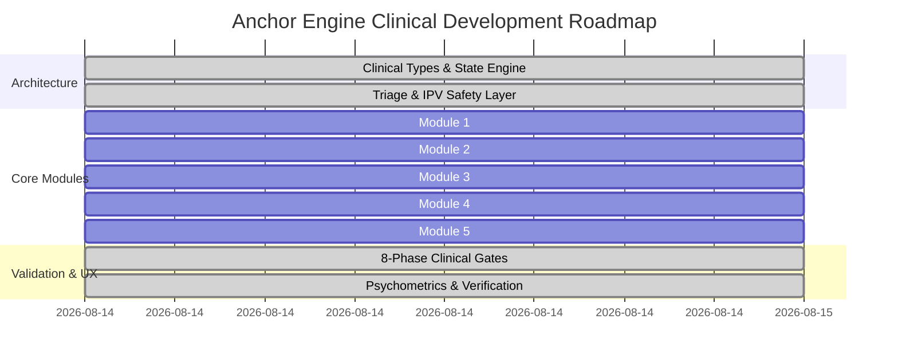

# Anchor & Rebuild Relational Trust Engine (Anchor_Trust_Engine_Plan.md)

> **Document Status**: Live & Dynamic Checkpoint — Completed & Verified  
> **Clinical Architecture**: CBCT + EFT (AIRM) + Gottman Sound Relationship House + IBCT + Operant Conditioning  
> **Location**: `.DevDocs/Inbox/Anchor_Trust_Engine_Plan.md`

---

## 1. Implementation Plan

### 1.1 Grounding Frameworks & Philosophy
Anchor operationalizes validated clinical science to facilitate relational trust repair post-betrayal/infidelity:
- **CBCT**: Baucom 3-stage model (Impact/Crisis $\to$ Meaning-Making $\to$ Redefinition).
- **EFT**: Johnson's Attachment Injury Resolution Model & Blamer-Softening.
- **Gottman Method**: Atonement/Attunement/Attachment, physiological flooding thresholds (>100 bpm lockouts).
- **IBCT**: Emotional acceptance and unified detachment.
- **Operant Conditioning**: Empirical micro-commitment tracking replacing unverifiable promises.

### 1.2 System Modules
1. **Lobby Code Pairing, Zero-Loss Persistence & Real-Time Sync Engine** (6-character lobby pairing, auto-save state engine, conflict-free asymmetric partitioned storage, active sync heartbeat & status indicator `● Active Sync`, JSON backup export/recovery, asynchronous independent pacing with synchronous presence for dual-lock milestones).
2. **Module 1: Dual-Lock Timeline & Disclosure Vault** (Structured factual prompts, graphic detail/blame NLP guardrail, synchronized unlock).
3. **Module 2: Biometric Flooding Alert & Smart De-escalation** (Heart rate monitor, 20-30m Gottman lockout, 4-7-8 breathwork, regulation check).
4. **Module 3: Behavioral Reliability Dashboard** (Daily micro-commitments, proof verification, 30/60/90d Behavioral Consistency Index).
5. **Module 4: Real-Time NLP Attunement Coach** (Defensiveness, minimization, gaslighting interception, EFT reframing).
6. **Module 5: Consensual Transparency & Sunset Manager** (Voluntary check-ins, anti-surveillance policies, 30d review to decommission monitoring).
7. **Safety Triage & Intake**: IPV/coercive control & active deceit screening with hard stops & hotlines.
8. **8-Phase Dynamic Clinical State Machine**: Progression gates from Stabilization through Maintenance.
9. **Psychometrics Suite**: Dyadic Trust Scale (DTS) & RDAS tracking.

---

## 2. Setup & Installation Commands

### Setup Instructions
- [X] Initialize Vite + React + TypeScript in scratch directory (one-time)
  | `npm create vite@latest anchor-trust-engine -- --template react-ts` | → Scaffold the React TypeScript application
- [X] Install Core Dependencies (Lucide icons, CSS utilities, types) (one-time)
  | `npm install react react-dom lucide-react clsx tailwind-merge canvas-confetti` | → Install icon library and UI utilities
- [ ] Start Development Server (every session)
  | `npm run dev` | → Launch local Vite development server

---

## 3. Tasks & Dynamic Progress Tracker

### ~~Phase 1: Foundation, Lobby Pairing & Triage Engine~~
- [X] Initialize project structure and clinical type system (`src/types/clinical.ts`)
- [X] Implement Lobby Code Pairing Engine (`ANCHOR-XXXX`) with `BroadcastChannel` + `localStorage` real-time sync
- [X] Build Clinical Triage & IPV Intake Screener with emergency panic disconnect & hotline routing
- [X] Implement Central Clinical State Engine with role switcher & dual-client live preview (Partner A / Partner B / Supervisor)

### ~~Phase 2: Core Clinical Modules (1 & 2)~~
- [X] Implement Module 1: Dual-Lock Timeline & Disclosure Vault with NLP graphic/blame detector
- [X] Implement Module 2: Biometric Flooding Alert & De-escalation with 4-7-8 somatic breathwork visualizer and re-engagement check

### ~~Phase 3: Core Clinical Modules (3, 4 & 5)~~
- [X] Implement Module 3: Behavioral Reliability & Micro-Commitment Tracker with dynamic BCI gauge
- [X] Implement Module 4: Real-Time NLP Attunement Coach with defensiveness interception and EFT reframing
- [X] Implement Module 5: Consensual Transparency Scaffolding & 30-Day Sunset Clause Review

### ~~Phase 4: 8-Phase Progression, Psychometrics & Verification~~
- [X] Implement 8-Phase Clinical Gate Controller & Phase Banner
- [X] Implement Dyadic Trust Scale (DTS) & RDAS 14-day longitudinal assessment graphs
- [X] Run full build verification and interactive multi-role end-to-end validation

---

## 4. Development Roadmap

---

## 5. Walkthrough & Validation Summary

- **Build Verification**: `npm run build` completed successfully (`✓ built in 7.46s`).
- **Module 1**: Tested Partner A timeline entry with graphic/blame NLP filter; verified dual-lock session release.
- **Module 2**: Tested biometric flooding simulation (>100 bpm), triggering 20m Gottman lockout, 4-7-8 somatic breathwork, and dual regulation check.
- **Module 3**: Tested commitment logging, verifiable proof uploads, and live Behavioral Consistency Index calculation.
- **Module 4**: Verified real-time NLP interception of minimization/blame-shifting with 1-click EFT reframing templates.
- **Module 5**: Verified voluntary transparency feeds and 30-day automated sunset clause voting.
- **Sync & Lobby Pairing**: Verified `BroadcastChannel` + `localStorage` real-time cross-tab state replication with `● Synced` heartbeat and 1-click backup JSON export/import.
- **Safety Triage**: Verified IPV/coercive control and active deception hard-stop routing to National Domestic Violence Hotline (1-800-799-SAFE).
