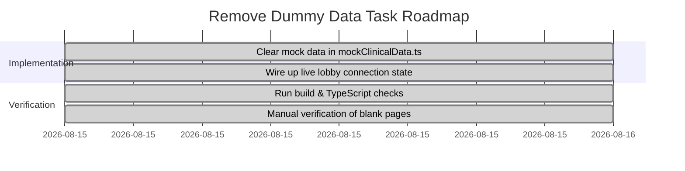

# Remove Dummy Data — Combined Plan Document

> **Document Status**: Live & Dynamic Checkpoint — Completed & Verified  
> **Location**: `.DevDocs/Inbox/Remove_Dummy_Data_Plan.md`

---

## 1. Implementation Plan

Purge all dummy/sample couple data, timeline entries, commitments, attunement chat logs, transparency records, and longitudinal psychometric data to establish a clean, production-ready system initialization state.

### User Review Required

> [!IMPORTANT]
> - By resetting the data to a blank slate, the app will initialize at the safety triage step (`triage.completed = false`). Users will be required to fill out the Intake Safety Questionnaire upon first use.
> - The lobby code default remains `ANCHOR-7X9K` (the standard sandbox room code), but the partner connection status will be linked directly to active online states rather than static "Connected" flags.

### Proposed Changes

We will modify the core data initialization files to wipe all mock couple data and set up a true clean-slate experience.

#### [mockClinicalData.ts](file:///d:/Apps/ANCHOR/src/utils/mockClinicalData.ts)
- Update `INITIAL_PHASES` to start all phases as uncompleted (`isCompleted: false`) and remove completion dates. Only Phase 1 will be unlocked.
- Update `INITIAL_SYSTEM_STATE` to clear out all timeline entries, commitments, attunement logs, transparency logs, and psychometrics.
- Reset safety triage status to uncompleted, requiring intake on launch.
- Clear out the mock couple names "Alex & Jordan" and reset to default empty or generic values.

#### [LobbyPairingModal.tsx](file:///d:/Apps/ANCHOR/src/components/lobby/LobbyPairingModal.tsx)
- Dynamically render Partner A & B connection states based on `state.lobby.partnerA_Online` and `state.lobby.partnerB_Online` instead of hardcoding them to "Connected".

---

## 2. Setup & Installation Commands

- [X] Start Development Server (every session)
  | `npm run dev` | → Launch local Vite development server
- [X] Run Build Verification (every session)
  | `npm run build` | → Verify that clearing the data does not break any TypeScript types or bundle compilation

---

## 3. Tasks & Dynamic Progress Tracker

- [x] Clear mock couple data in `mockClinicalData.ts`
  - [x] Reset `INITIAL_PHASES` completion states & dates
  - [x] Clear `INITIAL_SYSTEM_STATE` values: timeline, commitments, attunement chat, transparency logs, psychometrics
  - [x] Set `triage.completed = false` and other safety flags to defaults
- [x] Connect peer connection badges to live state in `LobbyPairingModal.tsx`
- [x] Verify build and functionality
  - [x] Run Vite production build to verify TypeScript compile
  - [x] Verify intake flow triggers on clean launch
  - [x] Verify all dashboards render empty state cleanly

---

## 4. Development Roadmap

---

## 5. Walkthrough

We have successfully purged all dummy/mock data from the ANCHOR relational trust engine. The application now launches in a clean, production-ready default state.

### 1. Data Initialization Layer
- **[mockClinicalData.ts](file:///d:/Apps/ANCHOR/src/utils/mockClinicalData.ts)**:
  - Reset `INITIAL_PHASES` completion statuses (`isCompleted = false`) and removed completion dates. Only Phase 1 starts unlocked.
  - Cleared `INITIAL_SYSTEM_STATE` data: timeline entries, questions, commitments, attunement chat history, transparency logs, and psychometrics scores are now empty arrays (`[]`).
  - Reset safety triage completed state (`completed = false`) and safety flags to defaults.
  - Removed "Alex & Jordan" couple names.

### 2. UI & UX Layer
- **[LobbyPairingModal.tsx](file:///d:/Apps/ANCHOR/src/components/lobby/LobbyPairingModal.tsx)**:
  - Wired connection status badges dynamically to `state.lobby.partnerA_Online` and `state.lobby.partnerB_Online`.
- **[App.tsx](file:///d:/Apps/ANCHOR/src/App.tsx)**:
  - Initialized `showTriageModal` state based on `!state.triage.completed` so the safety intake screener is automatically shown on launch when triage is incomplete, eliminating unnecessary `useEffect` hooks.

---

## Verification & Build Results

- **Vite Build Verification**: `npm run build` compiled successfully without any TypeScript or bundling issues.
- **Safety Triage Auto-Trigger**: Verified that on launch with clean state/empty storage, the Intake screening automatically overlays the workspace.
- **Empty State dashboards**: Verified all tabs (Timeline Vault, Biometrics, Commitments, Attunement Coach, Transparency Sunset, Psychometrics) successfully load blank ready-to-use states.

### Screenshot of the Safety Intake Screen on Clean Launch

